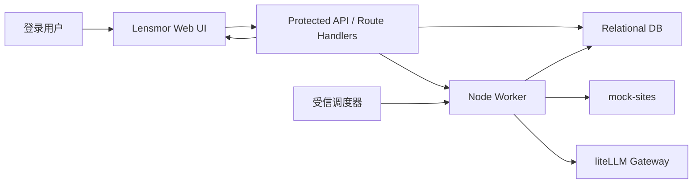

## 0. 基本信息

- 需求标识（分支 / ID）：001-build-monitor-mvp
- 标题（需求名 / RFC 名）：Lensmor Monitor MVP Greenfield Architecture RFC
- 作者：AI Agent
- 评审人：用户；产品负责人；研发负责人；测试负责人
- 状态：draft
- 最后更新：2026-06-16
- 关联链接：`requirements/solution.md`；`requirements/prd.md`；`requirements/prototype.md`；`design/research.md`

## 1. 结论摘要

- 一句话目标：为 Lensmor Monitor MVP 建立可实现、可验证的 greenfield TypeScript 全栈架构，支撑单用户登录、完整 onboarding、mock 竞品监控、统一采集分析任务、liteLLM 报告生成和情报收件箱闭环。
- In / Out 边界：In 对齐 `solution.md` 的网站监控 + Analysis Report 收件箱闭环；Out 仍为社媒分析、Strategic Summary、90 天历史演变、真实第三方站点大规模采集、多租户团队协作。
- 推荐方案：采用 Next.js App Router Web/API 容器 + 独立 Node Worker + 关系型 DB + 版本化 mock-sites + 服务端 liteLLM 集成。
- 关键取舍：优先单仓 TypeScript 降低 MVP 工程复杂度，同时把后台任务从用户请求生命周期中拆出；暂不引入 Redis、外部 Auth、真实浏览器采集等额外基础设施。
- 优先验证点：R1、R2、R3。

## 2. 范围与边界

- 系统边界：
  - Lensmor Monitor MVP 包含 Web UI、受保护 API、后台任务执行器、DB、mock 竞品站点和 liteLLM 服务端集成。
  - 浏览器只访问本系统 Web/API；不直接访问 liteLLM，也不持有 liteLLM key。
  - Worker 是受信后台执行单元，处理手动刷新和定时触发进入的采集分析任务。
- 影响面：
  - 新增 Onboarding、Auth、Competitor Monitoring、Collection Task、AI Analysis、Intelligence Inbox 六个逻辑模块。
  - 新增任务状态机、报告生成契约、mock 快照差异验证口径和单用户数据归属不变量。
  - 新增本地运行、测试和后续部署边界；当前没有现有系统可兼容。
- 明确不做：
  - 不做真实竞品站点自动发现和大规模采集。
  - 不做社媒品牌分析、Strategic Summary、90 天历史演变。
  - 不做组织、团队、RBAC、多租户。
  - 不引入 Redis 队列、外部 Auth SaaS、Playwright 浏览器采集作为 MVP 前置。
- 不变量：
  - 未登录不能访问 onboarding、竞品、任务、报告、反馈相关页面或接口。
  - 所有业务对象默认归属当前登录主体。
  - 手动刷新和定时任务复用同一任务执行管道。
  - AI 失败、采集失败、结构校验失败都不生成空报告。
  - liteLLM 网关地址和 key 只作为服务端运行时安全配置注入。

## 3. 推荐方案

### 3.1 C4-L1：System Context（系统上下文）

- 用户/角色：
  - 登录用户：完成 onboarding、维护竞品、触发刷新、查看报告、提交反馈。
  - 受信调度器：按配置周期触发定时监控。
  - 研发/测试：通过 mock 竞品快照验证差异和报告质量。
- 外部系统：
  - liteLLM 网关：服务端调用，用于生成 Analysis Report。
  - 运行时密钥配置：注入 liteLLM key、应用会话密钥和调度器服务令牌。
- 系统边界：
  - Lensmor Monitor MVP 对外暴露 Web UI 和受保护 API。
  - Worker、DB、mock-sites 与 liteLLM key 均在服务端可信边界内。
- 关键交互与主要输入输出：
  - Onboarding 输出用户角色与自有产品上下文。
  - 竞品管理输出 mock 竞品配置、状态和关联链接。
  - Collection Task 读取 mock 快照，生成差异，调用 AI Analysis。
  - AI Analysis 输出结构化 Analysis Report。
  - Intelligence Inbox 展示报告、已读状态和反馈。
- 关键约束与不变量：
  - 单用户登录保护所有产品域入口。
  - mock 竞品网站是 MVP 采集对象。
  - AI 生成必须在后台任务中执行，并受 30 秒预算、失败记录和不入箱规则约束。

### 3.2 C4-L2：Container（容器/部署单元）

- 容器清单：
  - `apps/web`：Next.js App Router 应用，承载 React UI、Server Components、Client Components 和受保护 Route Handlers。
  - `apps/worker`：独立 Node Worker，执行定时触发扫描、任务领取、mock 快照读取、差异分析、liteLLM 调用、报告入箱和失败记录。
  - `packages/domain`：共享领域服务与状态机规则，供 Web/API 与 Worker 复用。
  - `packages/db`：DB 访问、迁移和数据访问层；MVP 使用 Prisma ORM + SQLite，本地优先；保持迁移到 PostgreSQL 的 SQL 关系模型边界。
  - `mock-sites`：版本化 mock 竞品站点与快照 fixture。
  - `Relational DB`：持久化用户、onboarding、竞品、快照、任务、报告、已读和反馈。
  - `liteLLM Gateway`：外部 AI 网关，服务端通过 OpenAI-compatible chat completion 调用。
- 每个容器职责与主要技术选型：
  - Web/API：TypeScript、Next.js App Router、Node.js runtime Route Handlers。读页面优先 Server Components；表单、筛选、反馈等交互使用 Client Components。
  - Worker：TypeScript Node 进程；MVP 采用 DB-backed task polling 和定时 loop，保留后续替换为 Redis/BullMQ 的边界。
  - DB：SQLite 作为 MVP 本地默认，Prisma 管理 schema 与 migration；D2 不写字段细节，I1/I2 定义实际模型。
  - mock-sites：静态 HTML/fixture，可被 Worker 通过文件或本地 HTTP 读取；D2 只固定组织口径。
- 关键数据流：
  - 登录 -> onboarding -> 竞品配置 -> 创建任务 -> Worker 执行 -> 差异分析 -> liteLLM 生成 -> 报告入箱 -> 已读/反馈。
  - 定时任务和手动刷新只在触发准入层不同，进入任务执行层后完全共用。
- 对外契约入口：
  - 业务 API 契约后续沉淀到 `project/components/{module}.md#api-contract` 或 `project/contracts/`。
  - 报告结构契约后续沉淀到 AI Analysis / Intelligence Inbox 组件页。
  - 当前项目知识库缺失，见第 4 节 `CONTEXT GAP`。

### 3.3 C4-L3：Component（组件）

- `apps/web` 关键组件：
  - Auth Boundary：登录页、session 验证、受保护路由和未登录跳转。
  - Onboarding Flow：角色选择、自有产品信息、竞品导入。
  - Competitor UI：竞品列表、详情、状态、暂停/恢复、手动刷新入口。
  - Inbox UI：报告列表、筛选、详情、自动已读、反馈弹窗。
  - State Feedback：加载、空态、错误、无权限反馈。
- `apps/web` Route Handlers / API 组件：
  - Auth API：登录、退出、session 验证。
  - Onboarding API：保存角色、自有产品信息和初始竞品。
  - Competitor API：竞品 CRUD、暂停/恢复、关联链接上限校验。
  - Task API：手动刷新触发、任务状态查询、重试入口。
  - Report API：报告列表、详情、已读、反馈。
  - Scheduler Hook API：仅当定时触发需要 HTTP 入口时使用，必须服务到服务认证。
- `apps/worker` 关键组件：
  - Trigger Adapter：处理 scheduled/manual 触发准入，检查竞品状态、运行中任务和调度窗口。
  - Task Executor：按统一状态机执行任务。
  - Snapshot Reader：读取 mock-sites 快照。
  - Diff Analyzer：生成结构化 diff 和文本证据。
  - AI Reporter：服务端调用 liteLLM，使用结构化输出和业务校验。
  - Report Publisher：成功入箱；失败记录原因；无有意义变化不生成报告。
- 关键数据模型与状态流转：
  - 任务内部状态：`queued -> collecting -> diffing -> analyzing -> completed | failed`。
  - UI 可将 `collecting/diffing/analyzing` 合并展示为“采集进行中”，但任务面板可显示内部阶段文案。
  - 报告生成只允许由 completed 且有有意义变化的任务触发一次。
- 错误处理与幂等/一致性策略：
  - 同一竞品已有运行中任务时，重复手动刷新返回现有任务或提示正在采集中。
  - 定时触发以竞品 + 调度窗口去重。
  - AI 调用设置端到端 30 秒预算、有限重试、结构降级和失败落库。
  - liteLLM 结构化输出后仍需服务端业务校验。

### 3.4 关键决策与取舍

| # | 决策点 | 选择 | 取舍理由（为什么选它） | 若不满足前提的降级/替代 |
|---|---|---|---|---|
| D1 | Greenfield 技术栈 | TypeScript 全栈：Next.js App Router + Node Worker + Prisma + SQLite | 单仓、单语言、快速交付 Web/API/Worker MVP；用户已裁决 TypeScript 全栈 | 若 Worker/DB 复杂度超出预期，先保留手动刷新主路径，定时触发降级 |
| D2 | API 形态 | Next.js Route Handlers 使用 Node runtime | 与 App Router 同仓，保护 API 入口，便于鉴权与服务端调用 | 若部署平台限制长任务，保持 API 只创建任务，Worker 独立运行 |
| D3 | 任务执行 | 独立 Node Worker + DB-backed queue/polling | 避免 AI 生成绑定页面请求；无需 Redis 即可验证 MVP | 若任务积压或并发需求增长，后续替换为 Redis/BullMQ |
| D4 | AI 生成 | 服务端 Worker 调用 liteLLM + 结构化输出 + 服务端校验 | 避免 key 暴露和格式漂移，满足失败不入箱 | 若结构化输出不稳定，降级为更简单报告契约 |
| D5 | mock 采集 | 版本化 mock-sites + fixture diff | 可重复验证，不依赖真实站点 | 后续 M1 再引入真实采集或浏览器自动化 |
| D6 | Auth | 应用内单用户 session + 服务端对象归属检查 | 满足 MVP 安全边界，保留多用户扩展空间 | 若需要外部账号体系，新增 ADR 再接入 Auth SaaS |

### 3.5 对外承诺要点

- 契约（API/事件）：
  - MVP 对外只承诺本系统受保护 JSON API；不承诺公开外部 API。
  - 任务创建、任务查询、报告列表、报告详情、反馈提交都必须鉴权。
  - 具体 API 契约需在 `project/components/{module}.md#api-contract` 或 `project/contracts/` 中沉淀；当前为 `CONTEXT GAP`。
- 权限：
  - 所有产品域页面和接口必须验证 session。
  - 所有业务对象按当前登录主体做默认归属检查。
  - 调度器入口使用服务到服务认证，不使用隐藏 URL 作为安全机制。
- 数据口径：
  - Analysis Report 首版只表示网站变化分析报告。
  - Strategic Summary、历史演变、社媒分析不进入 MVP 数据口径。
  - mock 竞品网站是可控测试对象，不代表真实竞品采集能力已完成。
- 兼容性：
  - 当前无存量契约，所有模块为 greenfield 新增。
  - 后续若引入真实采集、多租户或战略总结，必须新增 ADR/契约并更新 project SSOT。
- 迁移与回滚：
  - MVP 从零创建，无历史数据迁移。
  - 运行回滚以停用 Worker、保留 DB 数据、回退 Web/API 版本为机制方向；具体命令进入 implementation plan。

## 4. 与现有系统的对齐

### 4.1 契约兼容性声明（逐模块）

- Onboarding：
  - API Contract：`CONTEXT GAP`，缺 `project/components/onboarding.md#api-contract`。
  - Data Contract：`CONTEXT GAP`，缺 `project/components/onboarding.md#data-contract`。
  - 兼容性结论：greenfield 新增模块；无现有契约可破坏，但现有系统对齐 DoD 未完全满足。
- Auth：
  - API Contract：`CONTEXT GAP`，缺 `project/components/auth.md#api-contract`。
  - Data Contract：`CONTEXT GAP`，缺 `project/components/auth.md#data-contract`。
  - 兼容性结论：greenfield 新增模块；必须在后续 project SSOT 中固定 session 和 ownership 不变量。
- Competitor Monitoring：
  - API Contract：`CONTEXT GAP`，缺 `project/components/competitor-monitoring.md#api-contract`。
  - Data Contract：`CONTEXT GAP`，缺 `project/components/competitor-monitoring.md#data-contract`。
  - 兼容性结论：greenfield 新增模块；关联链接上限 10 条、状态口径来自 PRD。
- Collection Task：
  - API Contract：`CONTEXT GAP`，缺 `project/components/collection-task.md#api-contract`。
  - Data Contract：`CONTEXT GAP`，缺 `project/components/collection-task.md#data-contract`。
  - 兼容性结论：greenfield 新增模块；状态机和幂等策略由本 RFC 固定。
- AI Analysis：
  - API Contract：`CONTEXT GAP`，缺 `project/components/ai-analysis.md#api-contract`。
  - Data Contract：`CONTEXT GAP`，缺 `project/components/ai-analysis.md#data-contract`。
  - 兼容性结论：greenfield 新增模块；liteLLM 集成仅服务端调用。
- Intelligence Inbox：
  - API Contract：`CONTEXT GAP`，缺 `project/components/intelligence-inbox.md#api-contract`。
  - Data Contract：`CONTEXT GAP`，缺 `project/components/intelligence-inbox.md#data-contract`。
  - 兼容性结论：greenfield 新增模块；首版只承载 Analysis Report。

### 4.2 ADR 合规声明（逐 ADR）

- `project/adr/index.md`：`CONTEXT GAP`，文件不存在。
  - 是否遵守：无法判定。
  - 动作：后续 merge-back 时至少新增技术栈、任务模型、AI 报告契约、单用户安全边界相关 ADR 或组件页决策入口。

### 4.3 状态机 / 领域事件影响

- 新增 Collection Task 状态机：
  - 新增状态：`queued`、`collecting`、`diffing`、`analyzing`、`completed`、`failed`。
  - 状态迁移规则：只允许从运行态进入 `completed` 或 `failed`；失败不生成报告；无有意义变化完成但不入箱。
  - 幂等/一致性：同一竞品运行中任务去重；同一任务最多发布一条报告；定时触发按调度窗口去重。
- `CONTEXT GAP`：缺 `project/components/collection-task.md#state-machines--domain-events`，无法引用现有状态机不变量。当前以 `requirements/solution.md`、`requirements/prd.md`、`design/research.md` 为权威输入。

### 4.4 跨模块影响确认

- 上游：
  - Auth 影响所有产品域 API 和页面。
  - Onboarding 输出 AI Analysis 需要的用户角色和自有产品上下文。
  - Competitor Monitoring 输出 Collection Task 需要的竞品、状态和 mock 链接。
- 下游：
  - Collection Task 驱动 AI Analysis。
  - AI Analysis 输出 Intelligence Inbox 所需的报告内容。
  - Intelligence Inbox 的反馈为后续质量改进提供数据。
- 交互方式：
  - Web/API 与 Worker 通过 DB-backed task queue 和共享 domain 服务交互。
  - Worker 与 liteLLM 通过服务端 HTTP 调用交互。
- `CONTEXT GAP`：缺 `project/components/index.md` 依赖关系图，跨模块影响来自 `solution.md#impact-analysis` 和 D1 research，现有系统对齐 DoD 未完全满足。

## 5. 影响分析

- 上下游系统影响：
  - 新增 liteLLM 外部依赖；需要网关地址、key、超时、重试和 fallback 配置。
  - 新增受信调度器入口；若采用 HTTP 触发，必须服务到服务认证。
  - 新增 Worker 运行单元；部署时需要和 Web/API 一起管理。
- 数据口径影响：
  - 所有业务对象默认归属当前登录主体。
  - 报告只表示 Analysis Report，不代表 Strategic Summary 或长期历史分析。
  - mock 快照差异是 MVP 的监控证据，不等同于真实站点采集能力。
- 运行与运维影响：
  - 需要环境变量或密钥管理注入 session secret、liteLLM base URL、liteLLM key、scheduler token。
  - 需要任务失败、AI 调用失败、耗时超标和重复报告风险的日志与指标。
  - 需要本地 dev 命令同时启动 Web/API、Worker、DB 和 mock-sites。
- 迁移/回滚要点：
  - 从零创建，无历史迁移。
  - 回滚时可停止 Worker 阻止新报告生成，保留 DB 数据，回退 Web/API。
  - 若 AI 报告契约失败率过高，可切换到降级契约，不进入收件箱空报告。

## 6. 风险与验证清单

| # | 风险/假设 | 验证方式 | 成功信号 | 失败信号 | Owner | 截止 | 下一步动作 |
|---|---|---|---|---|---|---|---|
| R1 | TypeScript 全栈能满足 Web/API/Worker MVP | I1 明确生成 dev/test 命令和工程骨架批次 | 可本地启动 Web/API 与 Worker | I1 无法定义可运行入口 | 研发负责人 | I1 完成前 | 失败则回到 D2 改为分层 Node API 或 Python 后端 |
| R2 | liteLLM 结构化报告质量达标 | 用 3 组 mock 快照调用用户提供网关 | 字段完整、失败率 <5%、单次 <30s | 超时、字段缺失或低相关 | 研发负责人 | D2 评审后 2 工作日 | 降低报告契约复杂度并增加重试/兜底 |
| R3 | mock fixture 足以验证差异价值 | 准备至少 5 个变化样例和 1 个噪音负例 | 至少 4 类能生成可解释差异 | diff 不稳定或报告过拟合 | 产品负责人；研发负责人 | I1 前 | 补充 mock 快照库或缩小变化类型声明 |
| R4 | DB-backed queue 足以支撑 MVP 任务并发 | 手动刷新和定时触发演练同一竞品重复触发 | 不重复创建运行中任务，不重复入箱 | 重复报告或任务状态不一致 | 研发负责人 | I2 首批任务完成前 | 引入更严格幂等键；必要时升级队列基础设施 |
| R5 | 单用户所有权边界可扩展 | 审查所有 API 是否从 session 推导 owner | 未登录拒绝，登录后只能访问当前主体数据 | 出现全局数据或客户端 owner 注入 | 研发负责人；测试负责人 | I1 评审前 | 补服务端授权边界后再实现业务 API |
| R6 | Project SSOT 缺失不会阻断 MVP | I1/I2 后 merge-back 初始化 components/ADR/ops | 首版代码与契约出现后可沉淀项目知识库 | 后续 Spec 无法复用模块边界 | 研发负责人 | MVP 可运行后 | 执行 spec-merge-back 或增量 Discover |

## 7. 追溯链接

- `requirements/solution.md`：推荐方案、Impact Analysis、Context Gaps、验证清单。
- `requirements/prd.md`：In/Out、核心场景、业务规则、AC、风险清单。
- `requirements/prototype.md`：任务流、页面清单、AC 映射。
- `design/research.md`：T1..T6 研究结论、风险与验证清单。
- `project/components/index.md`：`CONTEXT GAP`，文件不存在。
- 受影响模块 `project/components/{module}.md`：`CONTEXT GAP`，组件页不存在。
- 相关 `project/contracts/` 入口：`CONTEXT GAP`，目录不存在。
- 相关 `project/adr/` 入口：`CONTEXT GAP`，目录不存在。
- Next.js Context7 文档：App Router Route Handlers、Node runtime、Route Handler authentication。
- liteLLM Context7 文档：Proxy auth headers、structured outputs、retries、timeouts、fallbacks、cooldowns。
- Vercel React Best Practices：避免数据瀑布、减少客户端 bundle、服务端鉴权、Server Components 数据序列化边界。

## 8. 迭代记录

- 2026-06-16：创建 D2 RFC 初稿，原因是 D1 确认仓库为 greenfield，并且用户裁决采用 TypeScript 全栈方向。
- 2026-06-16：固定 Next.js App Router + Node Worker + DB-backed task queue 的架构方向，原因是 MVP 同时需要重交互 UI、受保护 API、异步任务和服务端 AI 集成。
- 2026-06-16：显式标注 project SSOT 缺失为 `CONTEXT GAP`，原因是当前仓库不存在组件页、ADR、契约和项目知识库，不能宣称已完成现有系统对齐。
