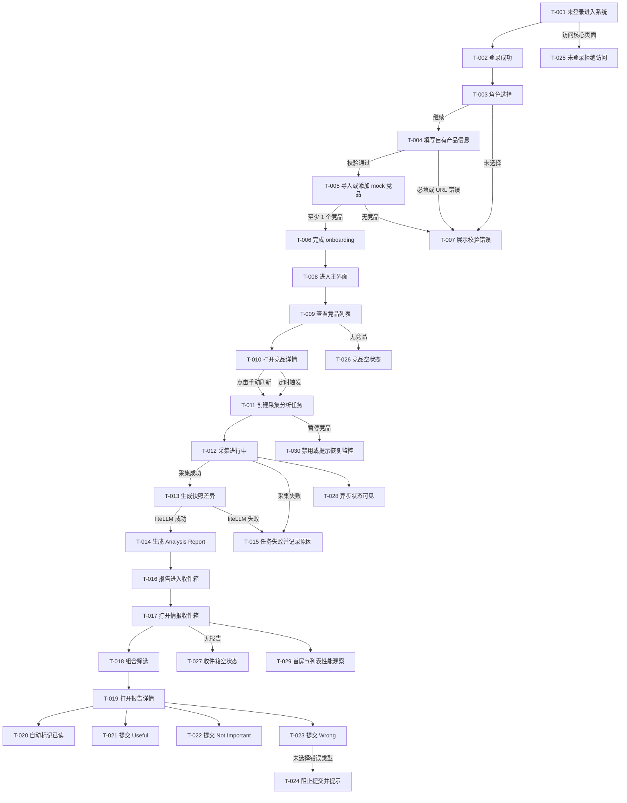

## 0. 基本信息

- 需求标识（分支 / ID）：001-build-monitor-mvp
- 作者 / 参与评审：AI Agent；用户；产品负责人；研发负责人；测试负责人
- 状态：draft
- 最后更新：2026-06-16
- Figma 链接入口：无

---

## 1. 场景清单

| 场景编号 | 场景标题（用户视角） | 成功标准 | 任务流节点 | 页面链路摘要 | PRD 对应 AC |
|---|---|---|---|---|---|
| S-001 | 首次进入并完成竞品配置 | 完成 3 步 onboarding；至少 1 个 mock 竞品监控中；分析上下文可读取 | T-001..T-008 | P-001 -> P-002 -> P-003 -> P-004 -> P-005 | AC-001..AC-004 |
| S-002 | 触发网站监控并生成 Analysis Report | 手动刷新和定时任务进入任务流；成功生成报告；失败记录原因 | T-009..T-016 | P-005 -> P-006 -> P-007 -> P-008 | AC-005..AC-009 |
| S-003 | 在情报收件箱消费并反馈报告 | 可筛选；打开详情自动已读；可提交反馈 | T-017..T-024 | P-009 -> P-010 -> D-001 | AC-010..AC-015 |
| S-004 | 安全与可用性边界 | 未登录被拒绝；空数据有引导；异步状态可见；性能目标可验证 | T-025..T-030 | P-001 / P-005 / P-009 / P-011 | AC-016..AC-020 |

---

## 2. 端到端任务流



---

## 3. 页面/弹窗清单

| Node ID | 类型 | 名称/目的 | 入口 | 覆盖任务流节点 | 覆盖场景 | 备注 |
|---|---|---|---|---|---|---|
| P-001 | P | 登录页 | 未登录访问系统或核心页面 | T-001,T-002,T-025 | S-001,S-004 | 单用户登录入口 |
| P-002 | P | Onboarding Step 1 角色选择 | P-001 登录成功且未完成 onboarding | T-003,T-007 | S-001 | 必选 |
| P-003 | P | Onboarding Step 2 自有产品信息 | P-002 继续 | T-004,T-007 | S-001 | 必填字段和 URL 校验 |
| P-004 | P | Onboarding Step 3 导入竞品 | P-003 提交成功 | T-005,T-006,T-007 | S-001 | 至少 1 个 mock 竞品 |
| P-005 | P | 主应用布局与竞品列表 | onboarding 完成或登录后进入 | T-008,T-009,T-026 | S-001,S-002,S-004 | 左侧竞品列表 |
| P-006 | P | 竞品详情 Overview | P-005 选择竞品 | T-010,T-011,T-030 | S-002 | 手动刷新入口 |
| P-007 | P | 任务状态面板 | P-006 刷新后或定时任务触发 | T-012,T-015,T-028 | S-002,S-004 | 展示排队、采集中、失败 |
| P-008 | P | 报告生成结果入口 | P-007 任务完成 | T-013,T-014,T-016 | S-002 | 跳转收件箱或报告详情 |
| P-009 | P | 情报收件箱 | 主导航 Inbox | T-017,T-018,T-027,T-029 | S-003,S-004 | 列表 + 详情双栏 |
| P-010 | P | Analysis Report 详情 | P-009 打开卡片 | T-019,T-020,T-021,T-022,T-023 | S-003 | 自动已读和反馈入口 |
| D-001 | D | Wrong 反馈弹窗 | P-010 点击 Wrong | T-023,T-024 | S-003 | 错误类型必选 |
| P-011 | P | 空状态与错误反馈页/区域 | P-005/P-009/P-007 无数据或失败 | T-026,T-027,T-028 | S-004 | 可作为页面区域实现 |

---

## 4. 页面说明

### 4.1 P-001 登录页

#### 4.1.1 入口与目的

- ID：P-001
- 页面目的：提供单用户登录入口，并拦截未登录访问。
- 入口：用户访问系统首页；或未登录访问主界面、竞品、任务、报告、反馈接口时被引导。
- 前置条件：用户未登录。
- 涉及场景：S-001、S-004。

#### 4.1.2 ASCII 线框

```text
P-001 Login
+------------------------------------------------------------+
| Lensmor Monitor                                            |
+------------------------------------------------------------+
| Email / Account                                            |
| [________________________________________________________] |
| Password                                                   |
| [________________________________________________________] |
|                                                            |
| [ Sign in ]                                                |
|                                                            |
| Message area: auth error / redirected from protected page  |
+------------------------------------------------------------+
```

#### 4.1.3 关键状态与反馈

| 状态 | 触发条件 | 界面要点 | 恢复路径 |
|---|---|---|---|
| 正常 | 未登录进入 | 显示账号、密码和 Sign in | 输入后提交 |
| 加载 | 点击 Sign in | 按钮 loading，输入框保持 | 请求结束恢复 |
| 空 | 字段为空提交 | 字段下方提示必填 | 保留输入 |
| 错误 | 登录失败 | message area 展示失败原因 | 可重试 |
| 无权限 | 未登录访问核心页面 | 展示登录页和来源提示 | 登录后回到目标页或 onboarding |

#### 4.1.4 关键校验与错误处理

- 账号和密码为空时阻止提交，字段下方提示。
- 登录失败不清空账号，密码可按安全实现清空。
- 未登录访问核心页面和接口必须拒绝访问，支撑 AC-016。

#### 4.1.5 跳转与交互

- 成功后：未完成 onboarding 进入 P-002；已完成 onboarding 进入 P-005。
- 失败后：停留 P-001，展示错误并允许重试。
- 返回：浏览器返回不绕过登录态校验。

---

### 4.2 P-002 Onboarding Step 1 角色选择

#### 4.2.1 入口与目的

- ID：P-002
- 页面目的：收集用户角色，作为后续 AI 分析上下文。
- 入口：P-001 登录成功且用户未完成 onboarding。
- 前置条件：已登录，onboarding 未完成。
- 涉及场景：S-001。

#### 4.2.2 ASCII 线框

```text
P-002 Onboarding Role
+------------------------------------------------------------+
| Step 1 of 3: Choose your role                              |
+------------------------------------------------------------+
| ( ) Product Marketing Manager                              |
| ( ) Product Manager                                        |
| ( ) Marketing Manager                                      |
| ( ) Founder                                                |
| ( ) Investor                                               |
| ( ) Other                                                  |
|                                                            |
| Error: please choose one role                              |
|                                      [ Next ]              |
+------------------------------------------------------------+
```

#### 4.2.3 关键状态与反馈

| 状态 | 触发条件 | 界面要点 | 恢复路径 |
|---|---|---|---|
| 正常 | 进入页面 | 展示 6 个角色选项 | 选择后下一步 |
| 加载 | 保存角色 | Next loading | 完成后进入 P-003 |
| 空 | 未选择提交 | 显示错误提示 | 选择任一角色 |
| 错误 | 保存失败 | 页面级错误 | 重试 |
| 无权限 | 登录态失效 | 跳转 P-001 | 重新登录 |

#### 4.2.4 关键校验与错误处理

- 必须选择一个角色才能继续，支撑 AC-001。
- 角色选项与 PRD BR-003 保持一致。

#### 4.2.5 跳转与交互

- 成功后：进入 P-003。
- 失败后：停留当前页并保留选择。
- 返回：返回 P-001 不改变登录态。

---

### 4.3 P-003 Onboarding Step 2 自有产品信息

#### 4.3.1 入口与目的

- ID：P-003
- 页面目的：收集自有产品上下文，供后续报告分析使用。
- 入口：P-002 选择角色后点击 Next。
- 前置条件：已登录，已选择角色。
- 涉及场景：S-001。

#### 4.3.2 ASCII 线框

```text
P-003 Product Info
+------------------------------------------------------------+
| Step 2 of 3: Your product                                  |
+------------------------------------------------------------+
| Product name:        [___________________________________] |
| URL:                 [___________________________________] |
| One-line desc:       [___________________________________] |
| Target audience:     [___________________________________] |
| Core selling points: [___________________________________] |
| Competitive edge:    [___________________________________] |
| Strategic goal:      [___________________________________] |
|                                                            |
| Error area: required fields / invalid URL                  |
|                         [ Back ] [ Next ]                  |
+------------------------------------------------------------+
```

#### 4.3.3 关键状态与反馈

| 状态 | 触发条件 | 界面要点 | 恢复路径 |
|---|---|---|---|
| 正常 | 进入页面 | 展示 7 个输入字段 | 填写后提交 |
| 加载 | 保存中 | Next loading | 完成后进入 P-004 |
| 空 | 必填为空 | 字段下方错误 | 保留输入 |
| 错误 | URL 无效或保存失败 | 字段错误或页面错误 | 修正后重试 |
| 无权限 | 登录态失效 | 跳转 P-001 | 重新登录 |

#### 4.3.4 关键校验与错误处理

- 名称、URL、一句话描述、目标受众、核心卖点、竞争优势、战略目标均必填，支撑 AC-002。
- URL 必须符合可解析格式。
- 保存失败时保留所有已输入内容。

#### 4.3.5 跳转与交互

- 成功后：进入 P-004。
- 失败后：停留 P-003。
- 返回：回到 P-002 并保留已填字段。

---

### 4.4 P-004 Onboarding Step 3 导入竞品

#### 4.4.1 入口与目的

- ID：P-004
- 页面目的：选择或添加至少 1 个 mock 竞品，使系统具备监控对象。
- 入口：P-003 保存成功。
- 前置条件：已登录，已有角色和自有产品信息。
- 涉及场景：S-001。

#### 4.4.2 ASCII 线框

```text
P-004 Import Competitors
+------------------------------------------------------------+
| Step 3 of 3: Import competitors                            |
+------------------------------------------------------------+
| Recommended mock competitors                               |
| [x] Acme AI       acme-ai.mock                             |
| [ ] Nova Stack    nova-stack.mock                          |
| [ ] Orbit CRM     orbit-crm.mock                           |
|                                                            |
| Add manually                                               |
| Name:        [____________________]                        |
| Main domain: [____________________] [ Add ]                |
|                                                            |
| Error: choose or add at least one competitor               |
|                         [ Back ] [ Finish setup ]          |
+------------------------------------------------------------+
```

#### 4.4.3 关键状态与反馈

| 状态 | 触发条件 | 界面要点 | 恢复路径 |
|---|---|---|---|
| 正常 | 推荐列表可用 | 展示 mock 竞品和手动添加区 | 选择后完成 |
| 加载 | 创建竞品 | Finish setup loading | 完成后 P-005 |
| 空 | 无推荐 mock 竞品 | 展示手动添加区 | 添加竞品 |
| 错误 | 无竞品提交或保存失败 | 错误提示 | 选择或重试 |
| 无权限 | 登录态失效 | 跳转 P-001 | 重新登录 |

#### 4.4.4 关键校验与错误处理

- 完成前至少需要 1 个竞品，支撑 AC-003。
- 手动添加竞品时名称和主域名必填。
- 竞品默认进入“监控中”状态。

#### 4.4.5 跳转与交互

- 成功后：进入 P-005。
- 失败后：保留已选择和已输入内容。
- 返回：回到 P-003。

---

### 4.5 P-005 主应用布局与竞品列表

#### 4.5.1 入口与目的

- ID：P-005
- 页面目的：展示竞品列表、全局导航和系统主入口。
- 入口：P-004 完成 setup；或已完成 onboarding 的用户登录。
- 前置条件：已登录且 onboarding 完成。
- 涉及场景：S-001、S-002、S-004。

#### 4.5.2 ASCII 线框

```text
P-005 App Shell / Competitors
+------------------------------------------------------------------+
| Lensmor Monitor                      [ Inbox ] [ Settings ] [Out]|
+----------------------+-------------------------------------------+
| Competitors          | Overview                                  |
| [ + Add ]            | Select a competitor to view details       |
|                      |                                           |
| * Acme AI            | Empty state: no competitor selected       |
|   Monitoring         |                                           |
| * Nova Stack         |                                           |
|   Paused             |                                           |
| * Orbit CRM          |                                           |
|   Collecting         |                                           |
+----------------------+-------------------------------------------+
```

#### 4.5.3 关键状态与反馈

| 状态 | 触发条件 | 界面要点 | 恢复路径 |
|---|---|---|---|
| 正常 | 有竞品 | 左侧列表显示 Logo、名称、状态 | 点击进入 P-006 |
| 加载 | 加载列表 | 左侧 skeleton | 完成后展示列表 |
| 空 | 无竞品 | 展示添加竞品入口 | 点击 Add |
| 错误 | 加载失败 | 错误区域和重试按钮 | 重试 |
| 无权限 | 未登录或过期 | 跳转 P-001 | 重新登录 |

#### 4.5.4 关键校验与错误处理

- 竞品状态显示值必须包含监控中、已暂停、采集进行中。
- 空状态必须提供添加竞品入口，支撑 AC-017。

#### 4.5.5 跳转与交互

- 点击竞品：进入 P-006。
- 点击 Inbox：进入 P-009。
- 点击退出：清除登录态并进入 P-001。

---

### 4.6 P-006 竞品详情 Overview

#### 4.6.1 入口与目的

- ID：P-006
- 页面目的：展示竞品基础信息、监控状态和手动刷新入口。
- 入口：P-005 点击某个竞品。
- 前置条件：已登录，竞品存在。
- 涉及场景：S-002。

#### 4.6.2 ASCII 线框

```text
P-006 Competitor Overview
+------------------------------------------------------------------+
| Acme AI                                      Status: Monitoring  |
| [ Edit ] [ Pause ] [ Manual refresh ]                           |
+------------------------------------------------------------------+
| Basic info                                                       |
| Main domain: acme-ai.mock                                        |
| Links: pricing, product, changelog                               |
|                                                                  |
| Latest intelligence                                              |
| - 2026-06-16 Pricing page changed        [ View report ]         |
| - No more reports                                                |
|                                                                  |
| Task banner: idle / collecting / failed                          |
+------------------------------------------------------------------+
```

#### 4.6.3 关键状态与反馈

| 状态 | 触发条件 | 界面要点 | 恢复路径 |
|---|---|---|---|
| 正常 | 状态监控中 | Manual refresh 可用 | 点击触发任务 |
| 加载 | 详情加载或任务创建中 | 按钮 loading，任务 banner 更新 | 完成后进入 P-007 |
| 空 | 无最新情报 | 显示空提示 | 可手动刷新 |
| 错误 | 详情加载失败 | 显示重试 | 重试 |
| 无权限 | 登录态失效 | 跳转 P-001 | 重新登录 |

#### 4.6.4 关键校验与错误处理

- 竞品已暂停时定时任务不触发，手动刷新入口禁用或提示先恢复监控，支撑 AC-006 和 E-003。
- 手动刷新创建任务后展示采集进行中状态，支撑 AC-005。

#### 4.6.5 跳转与交互

- Manual refresh 成功创建任务：进入或展开 P-007。
- Pause / Resume：更新竞品状态并刷新按钮可用性。
- View report：进入 P-010。

---

### 4.7 P-007 任务状态面板

#### 4.7.1 入口与目的

- ID：P-007
- 页面目的：展示采集分析任务生命周期和失败原因。
- 入口：P-006 手动刷新；定时任务触发后在竞品详情或任务区域显示。
- 前置条件：存在采集分析任务。
- 涉及场景：S-002、S-004。

#### 4.7.2 ASCII 线框

```text
P-007 Task Status
+------------------------------------------------------------+
| Collection task                                            |
+------------------------------------------------------------+
| Competitor: Acme AI                                        |
| Trigger: Manual refresh                                    |
| Status: Collecting                                         |
| Step: Fetch mock snapshot -> Diff -> AI report             |
|                                                            |
| Progress / message area                                    |
| [ View inbox ] [ Retry ]                                   |
+------------------------------------------------------------+
```

#### 4.7.3 关键状态与反馈

| 状态 | 触发条件 | 界面要点 | 恢复路径 |
|---|---|---|---|
| 正常 | 任务完成 | 显示完成和报告入口 | 进入 P-008/P-010 |
| 加载 | 排队或采集中 | 显示状态和步骤 | 等待或刷新 |
| 空 | 无任务 | 显示暂无任务 | 回 P-006 |
| 错误 | 采集或 AI 失败 | 显示失败原因，不生成空报告 | Retry |
| 无权限 | 登录态失效 | 跳转 P-001 | 重新登录 |

#### 4.7.4 关键校验与错误处理

- 任务失败必须记录失败原因，支撑 AC-009。
- 采集中状态必须可见，支撑 AC-018。
- 采集和 AI 任一失败都不生成空报告。

#### 4.7.5 跳转与交互

- 成功后：进入 P-008。
- 失败后：允许 Retry，重试仍复用同一任务模型。
- 返回：回到 P-006。

---

### 4.8 P-008 报告生成结果入口

#### 4.8.1 入口与目的

- ID：P-008
- 页面目的：确认报告已生成，并提供进入收件箱或详情的入口。
- 入口：P-007 任务成功完成。
- 前置条件：任务完成且 Analysis Report 已生成。
- 涉及场景：S-002。

#### 4.8.2 ASCII 线框

```text
P-008 Report Created
+------------------------------------------------------------+
| Report created                                             |
+------------------------------------------------------------+
| Title: Acme AI changed pricing CTA                         |
| Priority: Medium                                           |
| Created at: 2026-06-16 16:32                               |
|                                                            |
| [ Open report ] [ Go to inbox ] [ Back to competitor ]      |
+------------------------------------------------------------+
```

#### 4.8.3 关键状态与反馈

| 状态 | 触发条件 | 界面要点 | 恢复路径 |
|---|---|---|---|
| 正常 | 报告生成 | 展示标题、优先级、时间 | 打开报告 |
| 加载 | 报告写入中 | loading | 完成后显示 |
| 空 | 无报告 | 不进入此页 | 回 P-007 |
| 错误 | 报告读取失败 | 错误和重试 | 重试 |
| 无权限 | 登录态失效 | 跳转 P-001 | 重新登录 |

#### 4.8.4 关键校验与错误处理

- 只有成功生成报告才进入该页面，支撑 AC-008。
- 报告卡片字段需包含标题、关联竞品、生成时间和优先级。

#### 4.8.5 跳转与交互

- Open report：进入 P-010。
- Go to inbox：进入 P-009。
- Back：回 P-006。

---

### 4.9 P-009 情报收件箱

#### 4.9.1 入口与目的

- ID：P-009
- 页面目的：展示 Analysis Report 列表和筛选入口。
- 入口：主导航 Inbox；P-008 Go to inbox。
- 前置条件：已登录。
- 涉及场景：S-003、S-004。

#### 4.9.2 ASCII 线框

```text
P-009 Inbox
+------------------------------------------------------------------+
| Intelligence Inbox                                               |
+------------------------------------------------------------------+
| Filters: Competitor [ v ] Priority [ v ] Date [____ - ____]      |
+------------------------------+-----------------------------------+
| Reports                      | Select a report                   |
| [Unread] Acme AI pricing     |                                   |
| Medium | 2026-06-16          | Empty / preview area              |
|                              |                                   |
| [Read] Nova Stack homepage   |                                   |
| Low | 2026-06-15             |                                   |
+------------------------------+-----------------------------------+
```

#### 4.9.3 关键状态与反馈

| 状态 | 触发条件 | 界面要点 | 恢复路径 |
|---|---|---|---|
| 正常 | 有报告 | 左侧卡片列表，右侧预览 | 点击卡片 |
| 加载 | 加载列表 | 列表 skeleton | 完成后显示 |
| 空 | 无报告或筛选无结果 | 展示空状态和刷新/清除筛选入口 | 清除筛选或去竞品刷新 |
| 错误 | 加载失败 | 错误和重试 | 重试 |
| 无权限 | 登录态失效 | 跳转 P-001 | 重新登录 |

#### 4.9.4 关键校验与错误处理

- 竞品、优先级、日期范围可组合筛选，支撑 AC-010、AC-011、AC-012。
- 空列表展示下一步操作入口，支撑 AC-017。
- 单批加载时间目标不超过 2 秒，走查记录到 RISK-005 和 AC-020。

#### 4.9.5 跳转与交互

- 点击报告卡片：进入 P-010 或右侧显示 P-010 内容。
- 清除筛选：恢复默认列表。
- 返回：主应用内保持当前导航。

---

### 4.10 P-010 Analysis Report 详情

#### 4.10.1 入口与目的

- ID：P-010
- 页面目的：展示报告完整内容，并提供反馈入口。
- 入口：P-009 点击报告；P-008 Open report；P-006 View report。
- 前置条件：已登录，报告存在。
- 涉及场景：S-003。

#### 4.10.2 ASCII 线框

```text
P-010 Report Detail
+------------------------------------------------------------------+
| Acme AI changed pricing CTA        Priority: Medium   [Read]     |
| Competitor: Acme AI                Created: 2026-06-16            |
+------------------------------------------------------------------+
| What changed                                                      |
| - Pricing CTA changed from "Start free" to "Book demo"            |
|                                                                  |
| Strategic intent                                                  |
| - Shift toward sales-led conversion                               |
|                                                                  |
| Recommended actions                                               |
| - Medium: review own pricing page CTA                             |
|                                                                  |
| Source link: [ Open original ]                                    |
+------------------------------------------------------------------+
| Feedback: [ Useful ] [ Wrong ] [ Not Important ]                  |
+------------------------------------------------------------------+
```

#### 4.10.3 关键状态与反馈

| 状态 | 触发条件 | 界面要点 | 恢复路径 |
|---|---|---|---|
| 正常 | 报告存在 | 展示完整报告和反馈按钮 | 提交反馈 |
| 加载 | 打开详情 | 详情 skeleton | 完成后显示 |
| 空 | 报告不存在 | 显示不可用提示 | 返回列表 |
| 错误 | 加载失败 | 错误和重试 | 重试 |
| 无权限 | 登录态失效 | 跳转 P-001 | 重新登录 |

#### 4.10.4 关键校验与错误处理

- 打开详情后自动标记为已读，支撑 AC-013。
- Useful 和 Not Important 可直接提交反馈，支撑 AC-014。
- Wrong 必须进入 D-001 选择错误类型，支撑 AC-015。

#### 4.10.5 跳转与交互

- Useful / Not Important：提交成功后按钮展示已反馈状态。
- Wrong：打开 D-001。
- Open original：打开 mock 原始链接。

---

### 4.11 D-001 Wrong 反馈弹窗

#### 4.11.1 入口与目的

- ID：D-001
- 页面目的：收集 Wrong 反馈错误类型。
- 入口：P-010 点击 Wrong。
- 前置条件：已登录，报告详情已打开。
- 涉及场景：S-003。

#### 4.11.2 ASCII 线框

```text
D-001 Wrong Feedback
+------------------------------------------------------------+
| Why is this report wrong?                              [x] |
+------------------------------------------------------------+
| [ ] Inaccurate information                               |
| [ ] Irrelevant content                                   |
| [ ] Outdated data                                        |
| [ ] Duplicate information                                |
| [ ] Wrong strategic intent                               |
| [ ] Missing key change                                   |
| [ ] Too noisy                                            |
| [ ] Source data inaccurate                               |
|                                                            |
| Error: choose at least one reason                         |
|                                  [ Cancel ] [ Submit ]    |
+------------------------------------------------------------+
```

#### 4.11.3 关键状态与反馈

| 状态 | 触发条件 | 界面要点 | 恢复路径 |
|---|---|---|---|
| 正常 | 打开弹窗 | 展示错误类型多选或单选 | 选择后提交 |
| 加载 | 提交中 | Submit loading | 完成后关闭 |
| 空 | 未选择提交 | 错误提示 | 选择类型 |
| 错误 | 保存失败 | 错误提示 | 重试 |
| 无权限 | 登录态失效 | 关闭并跳转 P-001 | 重新登录 |

#### 4.11.4 关键校验与错误处理

- 未选择错误类型时阻止提交，支撑 AC-015。
- 错误类型与 PRD BR-012 保持一致。

#### 4.11.5 跳转与交互

- 成功后：关闭弹窗，P-010 显示已反馈状态。
- 失败后：保留选择并允许重试。
- 取消/关闭：回到 P-010，不保存反馈。

---

### 4.12 P-011 空状态与错误反馈区域

#### 4.12.1 入口与目的

- ID：P-011
- 页面目的：统一描述空数据、错误、无权限和异步状态反馈。
- 入口：P-005、P-007、P-009 等页面按状态内嵌展示。
- 前置条件：由具体页面状态触发。
- 涉及场景：S-004。

#### 4.12.2 ASCII 线框

```text
P-011 State Feedback
+------------------------------------------------------------+
| State title                                                |
| State message: what happened and what user can do next     |
|                                                            |
| [ Primary action ] [ Secondary action ]                    |
+------------------------------------------------------------+
```

#### 4.12.3 关键状态与反馈

| 状态 | 触发条件 | 界面要点 | 恢复路径 |
|---|---|---|---|
| 正常 | 状态恢复 | 回到原页面内容 | 无 |
| 加载 | 异步任务或列表加载 | skeleton、spinner 或任务状态 | 等待或刷新 |
| 空 | 无竞品、无报告、筛选无结果 | 说明原因和下一步动作 | 添加竞品、清除筛选、手动刷新 |
| 错误 | 网络、服务端、任务失败 | 错误摘要和重试 | 重试或返回 |
| 无权限 | 未登录或登录过期 | 登录引导 | 重新登录 |

#### 4.12.4 关键校验与错误处理

- 所有空数据场景必须给出下一步操作，支撑 AC-017。
- 所有异步操作必须提供可见状态，支撑 AC-018。

#### 4.12.5 跳转与交互

- Primary action：根据上下文进入添加竞品、清除筛选、手动刷新或重试。
- Secondary action：返回上一页或主界面。

---

## 5. AC -> 交互节点映射

| AC-ID / 描述 | 场景 | 任务流节点 | 页面/节点 | 验证点 |
|---|---|---|---|---|
| AC-001 角色选择后进入产品信息步骤 | S-001 | T-003,T-004,T-007 | P-002,P-003 | 未选角色阻止继续；选择后进入 P-003 |
| AC-002 自有产品信息保存后进入竞品导入 | S-001 | T-004,T-005,T-007 | P-003,P-004 | 必填和 URL 校验；成功进入 P-004 |
| AC-003 至少 1 个 mock 竞品后完成引导 | S-001 | T-005,T-006,T-007,T-008 | P-004,P-005 | 无竞品阻止完成；成功进入 P-005 |
| AC-004 报告生成可读取分析上下文 | S-001/S-002 | T-006,T-013,T-014 | P-004,P-007,P-008 | onboarding 输出传入报告生成流程，走查时记录上下文字段 |
| AC-005 手动刷新创建任务并展示采集中 | S-002 | T-010,T-011,T-012 | P-006,P-007 | Manual refresh 可用；创建任务；显示 Collecting |
| AC-006 定时任务按竞品状态触发或跳过 | S-002 | T-011,T-012,T-030 | P-006,P-007 | 监控中创建任务；已暂停不创建任务 |
| AC-007 新快照与上一快照差异后调用 liteLLM | S-002 | T-012,T-013,T-014 | P-007,P-008 | 任务步骤展示 Diff -> AI report |
| AC-008 liteLLM 成功后收件箱新增报告卡片 | S-002 | T-014,T-016,T-017 | P-008,P-009 | 卡片展示标题、竞品、时间、优先级 |
| AC-009 失败任务记录原因且不生成空报告 | S-002 | T-015 | P-007 | 失败状态和原因可见；无空报告 |
| AC-010 按竞品筛选 | S-003 | T-017,T-018 | P-009 | 列表只展示匹配竞品 |
| AC-011 按优先级筛选 | S-003 | T-017,T-018 | P-009 | 列表只展示匹配优先级 |
| AC-012 按日期范围筛选 | S-003 | T-017,T-018 | P-009 | 列表只展示范围内报告 |
| AC-013 打开详情自动已读 | S-003 | T-019,T-020 | P-009,P-010 | 未读卡片打开后变为 Read |
| AC-014 提交 Useful/Wrong/Not Important | S-003 | T-021,T-022,T-023 | P-010,D-001 | 反馈保存并显示已反馈状态 |
| AC-015 Wrong 未选错误类型阻止提交 | S-003 | T-023,T-024 | D-001 | 未选择时报错，选择后可提交 |
| AC-016 未登录拒绝核心访问 | S-004 | T-001,T-025 | P-001 | 访问核心页面或接口被引导登录 |
| AC-017 空状态提供引导 | S-004 | T-026,T-027 | P-005,P-009,P-011 | 无竞品、无报告、筛选无结果有下一步动作 |
| AC-018 异步任务状态可见 | S-004 | T-012,T-028 | P-007,P-011 | 排队、采集中、失败状态可见 |
| AC-019 首屏加载目标不超过 3 秒 | S-004 | T-029 | P-005,P-009 | 走查记录首屏加载观察值 |
| AC-020 单批收件箱加载目标不超过 2 秒 | S-004 | T-029 | P-009 | 走查记录列表加载观察值 |

---

## 6. 走查/验证脚本

### 6.1 覆盖的验证清单条目

- RISK-001：liteLLM 网关配置与报告质量。
- RISK-002：mock 竞品网站变化样例覆盖度。
- RISK-003：定时任务与手动刷新共用任务模型。
- RISK-004：单用户登录安全边界。
- RISK-005：项目现有架构入口缺失。

### 6.2 任务脚本

**任务-1（S-001 首次进入并完成竞品配置）**

- 任务目标：验证用户能从登录进入完整 3 步 onboarding，并创建至少 1 个监控中的 mock 竞品。
- 关键步骤：
  - T-001/P-001：未登录访问系统并登录。
  - T-003/P-002：选择一个角色并继续。
  - T-004/P-003：填写 7 个自有产品字段并继续。
  - T-005/P-004：选择或添加 1 个 mock 竞品。
  - T-006/P-005：完成 onboarding 并进入主界面。
- 成功标准：AC-001、AC-002、AC-003、AC-004 均可观察。
- 观察点/记录项：必填校验、URL 校验、完成后竞品状态、分析上下文字段是否保存。

**任务-2（S-002 触发网站监控并生成 Analysis Report）**

- 任务目标：验证手动刷新和定时任务都进入统一采集分析流程，并能成功或失败可追踪。
- 关键步骤：
  - T-009/P-005：选择监控中的竞品。
  - T-010/P-006：打开竞品详情。
  - T-011/P-006：点击 Manual refresh。
  - T-012/P-007：观察任务状态。
  - T-013/P-007：确认生成差异。
  - T-014/P-008：确认 liteLLM 成功后生成报告。
  - T-015/P-007：模拟采集或 AI 失败并确认失败原因。
- 成功标准：AC-005、AC-006、AC-007、AC-008、AC-009 均可观察。
- 观察点/记录项：任务状态机、失败原因、无变化策略、暂停竞品触发策略、报告卡片字段。

**任务-3（S-003 在情报收件箱消费并反馈报告）**

- 任务目标：验证用户能筛选、阅读、自动已读并提交反馈。
- 关键步骤：
  - T-017/P-009：打开情报收件箱。
  - T-018/P-009：分别按竞品、优先级、日期范围筛选。
  - T-019/P-010：打开一条未读报告。
  - T-020/P-010：确认报告标记为已读。
  - T-021/P-010：提交 Useful。
  - T-022/P-010：提交 Not Important。
  - T-023/D-001：点击 Wrong 并选择错误类型提交。
  - T-024/D-001：不选择错误类型提交，确认被阻止。
- 成功标准：AC-010、AC-011、AC-012、AC-013、AC-014、AC-015 均可观察。
- 观察点/记录项：筛选组合结果、已读状态变化、反馈保存结果、Wrong 错误类型校验。

**任务-4（S-004 安全与可用性边界）**

- 任务目标：验证登录保护、空状态、异步状态和性能目标的可观察性。
- 关键步骤：
  - T-025/P-001：未登录访问核心页面和报告接口。
  - T-026/P-005/P-011：清空竞品样例并查看竞品空状态。
  - T-027/P-009/P-011：清空报告或筛选无结果并查看收件箱空状态。
  - T-028/P-007/P-011：触发采集任务并观察异步状态。
  - T-029/P-005/P-009：记录首屏和单批报告加载耗时。
- 成功标准：AC-016、AC-017、AC-018、AC-019、AC-020 均可观察。
- 观察点/记录项：未登录跳转、空状态文案和动作、任务状态可见性、加载耗时。

### 6.3 记录方式（问题清单模板）

| 问题 | 严重度（S1/S2/S3） | 复现步骤 | 影响范围（场景/页面/AC） | 建议修复方向 |
|---|---|---|---|---|
| 示例：Wrong 未选错误类型仍可提交 | S2 | P-010 -> Wrong -> Submit | S-003 / D-001 / AC-015 | 在 D-001 提交前增加必选校验 |

### 6.4 结论与回流

- 结论摘要：R3 原型覆盖 PRD 的 4 个场景、12 个页面/弹窗节点和 AC-001..AC-020。
- 需要回流更新的文件：
  - `requirements/solution.md`：当 MVP 边界、推荐方案、风险或验证项发生变化时回流。
  - `requirements/prd.md`：当 AC、业务规则、范围或异常策略发生变化时回流。
  - `requirements/prototype.md`：当页面结构、状态反馈、跳转或 AC 映射发生变化时回流。

---

## 7. 追溯链接

- PRD：`requirements/prd.md`（核心场景、业务规则、AC、风险/依赖与验证清单）。
- Solution：`requirements/solution.md`（推荐方案、Impact Analysis、Context Gaps、验证清单）。
- Raw：`requirements/raw.md`（原始需求与 R1 澄清记录）。
- 术语与口径：当前无 `project/memory/glossary.md`，术语以 `requirements/prd.md` 与 `requirements/solution.md` 为准。

---

## 8. R3-DoD 自检

- [x] 交互内容与 PRD 的场景/规则/AC 一一对应。
- [x] 任务流、节点清单与页面清单一致（可追溯、可定位）。
- [x] 每个页面至少包含入口、ASCII 线框、状态、跳转。
- [x] 关键状态覆盖完整（正常/加载/空/错/无权限；提交类交互包含成功/失败反馈与恢复路径）。
- [x] 高风险/不可逆操作包含风险提示或校验策略；不确定项引用 PRD/solution 的验证清单。
- [x] 与 PRD 的 AC 可追溯（能指出哪个页面/哪个状态支持哪条 AC）。
- [x] 包含走查/验证脚本章节（含任务脚本与回流指引）。
